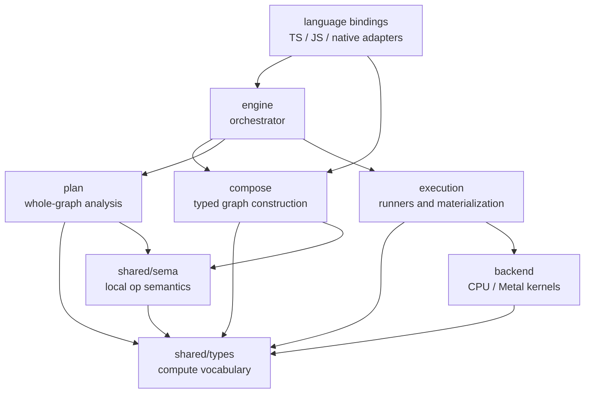

# Compute Architecture

The compute core is organized around a small pipeline plus shared cross-cutting
layers. The directory layout should make the dependency direction visible.

```text
src/compute/
  shared/
    types/      # Tensor, TensorSpec, Op, Graph, plan structs
    sema/       # local op contracts and inference over shared/types
    repr.zig    # shared tensor representation helpers

  compose/      # builds typed graphs
  plan/         # whole-graph analysis, canonicalization, execution planning
  execution/    # eager and graph runners, materialization, autograd recording
  backend/      # CPU / Metal capability and kernels

  engine.zig    # orchestrates compose -> plan -> execution
  core.zig      # public compute namespace
```

## Dependency Shape



```text
shared/types
  <- shared/sema
  <- compose
  <- plan
  <- execution
  <- backend

shared/sema
  <- compose
  <- plan

compose -> plan -> execution -> backend

engine orchestrates the pipeline.
language bindings should enter through engine or sanctioned compose/capture APIs.
```

## Layer Roles

- `shared/types` is the compute vocabulary. It should not depend on compose,
  plan, sema, execution, backend, engine, or bindings.
- `shared/sema` owns local operation semantics: given an op, input specs, and
  options, infer and validate output specs.
- `compose` builds typed graphs and may use local sema while constructing values.
- `plan` owns whole-graph analysis and execution planning. It may use shared sema,
  but local op inference is not plan-private.
- `execution` runs eager or graph plans and records runtime events.
- `backend` owns device-specific capabilities and kernels.
- `engine` is the orchestrator connecting the pipeline layers.

`engine` should not own local sema calls directly. It should ask compose or plan
to produce the next pipeline artifact.

## Binding Boundary

Language bindings adapt their host representation into compute vocabulary; they
do not own compute semantics.

- TS capture owns syntax and graph-node construction for the JS surface.
- Captured lowering owns conversion from captured JSON into compose inputs.
- Captured op-name mapping is shared inside the binding adapter so JS inference
  and JSON lowering cannot drift on basic vocabulary.
- `shared/sema` is the metadata authority. Captured metadata should be resolved
  by compute core through the native inference bridge when input metadata is
  available.
- TS shadow metadata is compatibility fallback only. If it disagrees with
  compute core, the binding records `inferenceConflicts` rather than silently
  choosing the TS answer.
- Summary/export shape fields are reporting metadata. They may provide
  best-effort display shapes, but they are not graph construction semantics.
- Captured lowering should add operations through compose APIs such as the graph
  builder, not by directly rebuilding output specs in the binding layer.
